# 16-bit ALU (Verilog)

A modular, synchronous 16-bit Arithmetic Logic Unit built from a central opcode decoder and four independent functional units — **Arithmetic**, **Logic**, **Compare**, and **Shift** — each with its own enable, 16-bit output bus, and status flag.

## Architecture

`ALU_TOP` decodes a 4-bit opcode (`ALU_FUN`) into individual enable signals and dispatches the operation to the matching sub-unit. Each sub-unit is only active when its enable is asserted, and only that unit's flag/output is meaningful on a given operation.

<p align="center">
  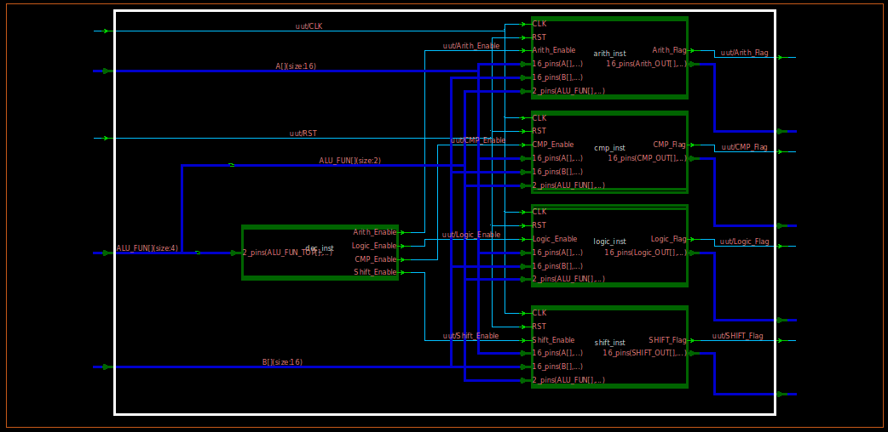
</p>

| Sub-block          | Role                                                                 |
|---------------------|-----------------------------------------------------------------------|
| `Decoder`           | Decodes `ALU_FUN[3:2]` into `Arith_Enable`, `Logic_Enable`, `CMP_Enable`, `Shift_Enable` |
| `ARITHMETIC_UNIT`   | Add / Subtract / Multiply / Divide                                   |
| `LOGIC_UNIT`        | Bitwise AND / OR / NAND / NOR                                        |
| `CMP_UNIT`          | Equal / Greater-than / Less-than comparison                          |
| `SHIFT_UNIT`        | Logical shift-left / shift-right on `A` or `B`                       |

## Top-Level Port List (`ALU_TOP`)

| Signal        | Direction | Width  | Description                          |
|---------------|-----------|--------|----------------------------------------|
| `CLK`         | Input     | 1      | Clock                                  |
| `RST`         | Input     | 1      | Synchronous reset                      |
| `A`           | Input     | [15:0] | Operand A                              |
| `B`           | Input     | [15:0] | Operand B                              |
| `ALU_FUN`     | Input     | [3:0]  | Opcode — selects unit and operation    |
| `Arith_OUT`   | Output    | [15:0] | Arithmetic unit result                 |
| `Arith_Flag`  | Output    | 1      | Asserted when the arithmetic unit is active |
| `Logic_OUT`   | Output    | [15:0] | Logic unit result                      |
| `Logic_Flag`  | Output    | 1      | Asserted when the logic unit is active |
| `CMP_OUT`     | Output    | [15:0] | Compare unit result (`1`=Equal, `2`=Greater, `3`=Less) |
| `CMP_Flag`    | Output    | 1      | Asserted when the compare unit is active |
| `SHIFT_OUT`   | Output    | [15:0] | Shift unit result                      |
| `SHIFT_Flag`  | Output    | 1      | Asserted when the shift unit is active |

## Opcode Map (`ALU_FUN[3:0]`)

`ALU_FUN[3:2]` selects the sub-unit; `ALU_FUN[1:0]` selects the operation within it.

| ALU_FUN | Unit        | Operation           |
|---------|-------------|----------------------|
| `0000`  | Arithmetic  | ADD                  |
| `0001`  | Arithmetic  | SUB                  |
| `0010`  | Arithmetic  | MUL                  |
| `0011`  | Arithmetic  | DIV                  |
| `0100`  | Logic       | AND                  |
| `0101`  | Logic       | OR                   |
| `0110`  | Logic       | NAND                 |
| `0111`  | Logic       | NOR                  |
| `1000`  | Compare     | NOP (no comparison)  |
| `1001`  | Compare     | EQUAL                |
| `1010`  | Compare     | GREATER THAN         |
| `1011`  | Compare     | LESS THAN            |
| `1100`  | Shift       | SHIFT A RIGHT        |
| `1101`  | Shift       | SHIFT A LEFT         |
| `1110`  | Shift       | SHIFT B RIGHT        |
| `1111`  | Shift       | SHIFT B LEFT         |

## Sub-Unit Details

### Decoder
<p align="center">
  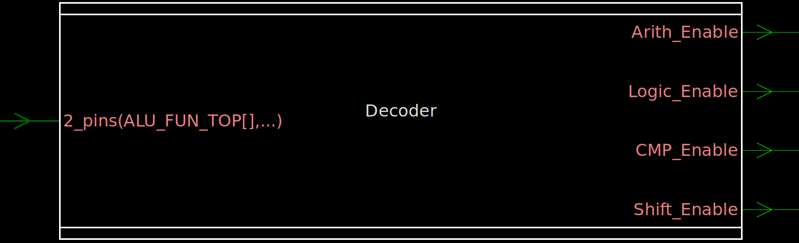
</p>
<p align="center">
  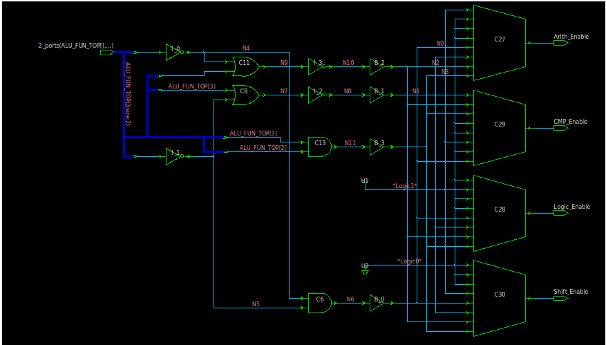
</p>

Combinationally maps the top 2 bits of `ALU_FUN` into one-hot enable signals for the four functional units.

### Arithmetic Unit
<p align="center">
  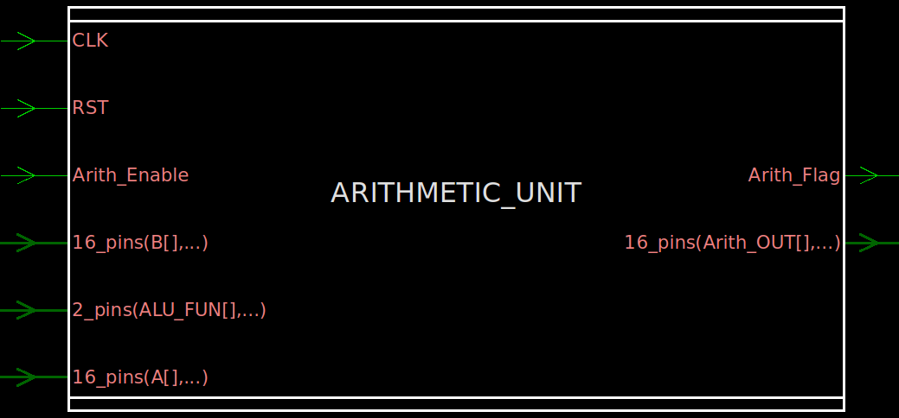
</p>
<p align="center">
  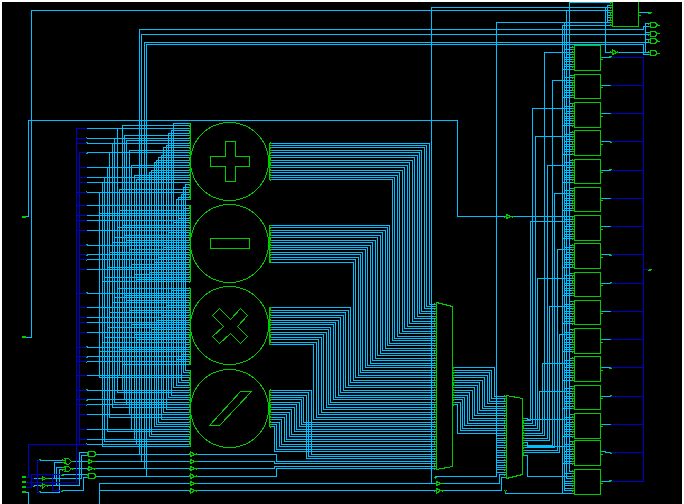
</p>

Performs signed ADD, SUB, MUL, and DIV on `A` and `B`, active when `Arith_Enable` is high.

### Logic Unit
<p align="center">
  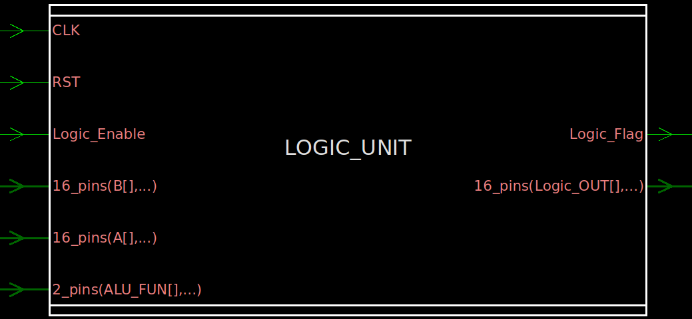
</p>
<p align="center">
  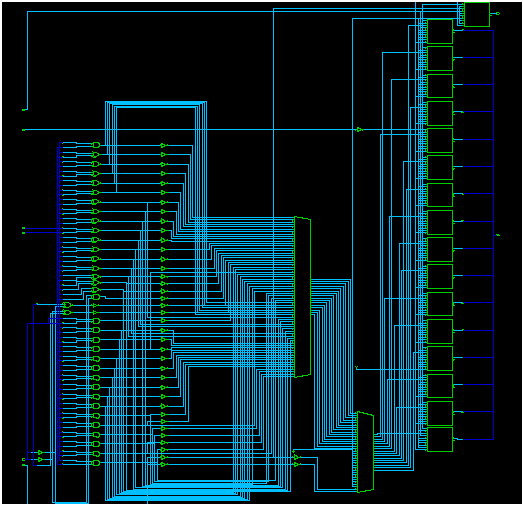
</p>

Performs bitwise AND, OR, NAND, and NOR on `A` and `B`, active when `Logic_Enable` is high.

### Compare Unit
<p align="center">
  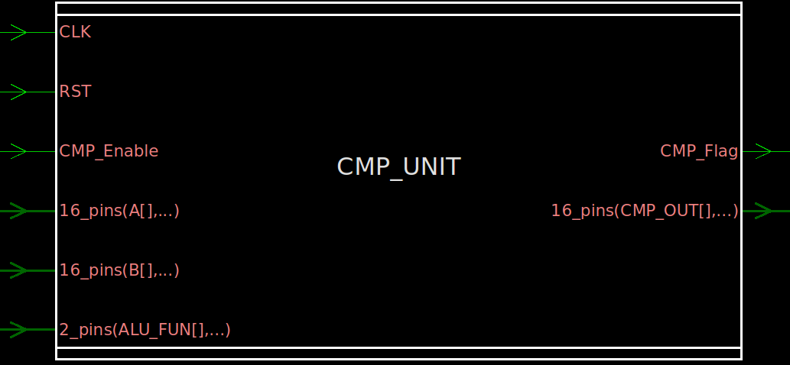
</p>
<p align="center">
  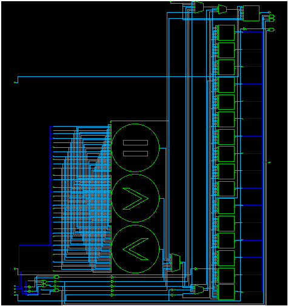
</p>

Compares `A` and `B` for equality, greater-than, and less-than, active when `CMP_Enable` is high. Result is encoded on `CMP_OUT` (`1`=Equal, `2`=Greater, `3`=Less).

### Shift Unit
<p align="center">
  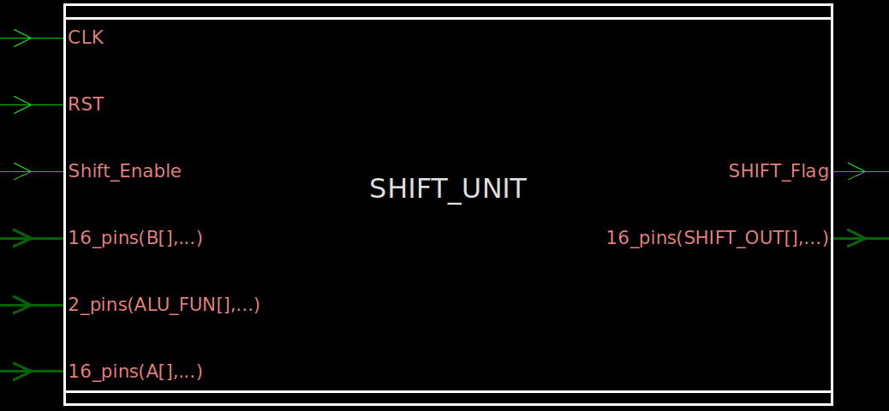
</p>
<p align="center">
  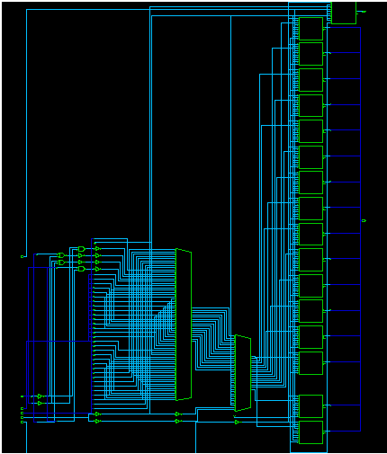
</p>

Performs a logical shift (by 1 bit) left or right on either `A` or `B`, active when `Shift_Enable` is high.

## Testbench

`ALU_TOP_tb.v` runs a self-checking **28-case** simulation covering every opcode, including signed edge cases (positive/negative combinations) for each arithmetic operation:

| Coverage                          | Cases |
|------------------------------------|-------|
| ADD (Neg+Neg, Pos+Neg, Neg+Pos, Pos+Pos) | 4 |
| SUB (same 4 sign combinations)     | 4 |
| MUL (same 4 sign combinations)     | 4 |
| DIV (same 4 sign combinations)     | 4 |
| Logic: AND, OR, NAND, NOR          | 4 |
| Compare: Equal, Greater, Less      | 3 |
| Shift: A>>, A<<, B>>, B<<          | 4 |
| NOP                                 | 1 |

All 28 test cases passed, each printed with the operand values, opcode, and all four output buses/flags for cross-checking.

### Sample Transcript Output

```
# Test:      ADD Neg+Neg | A:     -4, B:    -10 | ALU_FUN: 0000 | Arith_OUT:    -14, Logic_OUT:     0, CMP_OUT:     0, SHIFT_OUT:     0
# Test:      LOGIC AND   | A:   -256, B:   3855 | ALU_FUN: 0100 | Arith_OUT:      0, Logic_OUT:  3840, CMP_OUT:     0, SHIFT_OUT:     0
# Test:      CMP Greater | A:     50, B:     10 | ALU_FUN: 1010 | Arith_OUT:      0, Logic_OUT:     0, CMP_OUT:     2, SHIFT_OUT:     0
# Test:      SHIFT A <<  | A:      4, B:      0 | ALU_FUN: 1101 | Arith_OUT:      0, Logic_OUT:     0, CMP_OUT:     0, SHIFT_OUT:     8
# --- SIMULATION COMPLETE ---
```

### Waveform

<p align="center">
  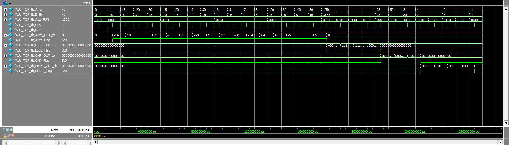
</p>

## Running the Simulation (ModelSim / QuestaSim)

```tcl
cd RTL
vlib work
vlog Decoder.v ARITHMETIC_UNIT.v LOGIC_UNIT.v CMP_UNIT.v SHIFT_UNIT.v ALU_TOP.v ALU_TOP_tb.v
vsim -gui work.ALU_TOP_tb
do wave.do
run -all
```

`wave.do` preloads the waveform view with `A`, `B`, `ALU_FUN`, `CLK`, `RST`, and each unit's output bus and flag.

## Linting

The design was checked with **Synopsys SpyGlass** (`Lint/Lint.prj`, `rtl_handoff` methodology), reading all six RTL source files with `ALU_TOP` set as the top module. The `moresimple` report came back clean (design-read info messages only, no lint violations).

## Repository Structure

```
.
├── RTL/
│   ├── ALU_TOP.v            # Top-level ALU (decoder + dispatch)
│   ├── ALU_TOP_tb.v         # 28-case self-checking testbench
│   ├── ARITHMETIC_UNIT.v    # ADD / SUB / MUL / DIV
│   ├── CMP_UNIT.v           # Equal / Greater / Less
│   ├── Decoder.v            # Opcode-to-enable decoder
│   ├── LOGIC_UNIT.v         # AND / OR / NAND / NOR
│   ├── SHIFT_UNIT.v         # Shift left/right on A or B
│   ├── Transcript           # Simulation log
│   └── wave.do              # ModelSim/QuestaSim waveform config
├── Lint/
│   ├── Lint.prj             # SpyGlass lint project file
│   ├── moresimple.rpt       # SpyGlass lint report
│   └── test                 # SpyGlass run artifacts
├── images/
│   ├── uut.png                     # Top-level RTL schematic
│   ├── Decoder.png / Decoder_RTL.png
│   ├── ARITHMETIC_UNIT.png / ARITHMETIC_UNIT_RTL.png
│   ├── LOGIC_UNIT.png / LOGIC_UNIT_RTL.png
│   ├── CMP_UNIT.png / CMP_UNIT_RTL.png
│   ├── SHIFT_UNIT.png / SHIFT_UNIT_RTL.png
│   └── Wave.png                    # Simulation waveform
├── LICENSE
└── README.md
```

## License

See [LICENSE](LICENSE) for details.
